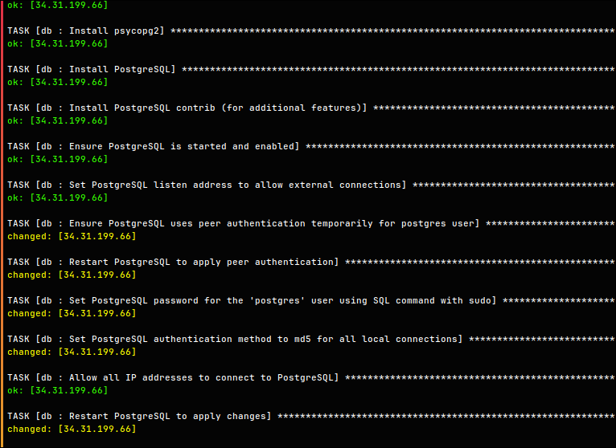

# DB

Database is Postgresql.

## Playbook

It is deployed with ansible playbook:

```yml
---
- name: Install psycopg2
  apt:
    name: python3-psycopg2
    state: present
  become: yes

- name: Install PostgreSQL
  apt:
    name: postgresql
    state: present
  become: yes

- name: Install PostgreSQL contrib (for additional features)
  apt:
    name: postgresql-contrib
    state: present
  become: yes

- name: Ensure PostgreSQL is started and enabled
  service:
    name: postgresql
    state: started
    enabled: true
  become: yes

- name: Set PostgreSQL listen address to allow external connections
  lineinfile:
    path: /etc/postgresql/{{ postgresql_version }}/main/postgresql.conf
    regexp: "^#?listen_addresses =.*"
    line: "listen_addresses = '*'"
  become: yes

- name: Ensure PostgreSQL uses peer authentication temporarily for postgres user
  lineinfile:
    path: /etc/postgresql/{{ postgresql_version }}/main/pg_hba.conf
    regexp: '^local\s+all\s+postgres\s+md5'
    line: "local   all             postgres                                peer"
  become: yes

- name: Restart PostgreSQL to apply peer authentication
  service:
    name: postgresql
    state: restarted
  become: yes

- name: Set PostgreSQL password for the 'postgres' user using SQL command with sudo
  shell: 'sudo -u postgres psql -c "ALTER USER postgres WITH PASSWORD ''{{ db_password }}'';"'
  become: yes
  args:
    executable: /bin/bash

- name: Set PostgreSQL authentication method to md5 for all local connections
  lineinfile:
    path: /etc/postgresql/{{ postgresql_version }}/main/pg_hba.conf
    regexp: '^local\s+all\s+postgres\s+peer'
    line: "local   all             postgres                                md5"
  become: yes

- name: Allow all IP addresses to connect to PostgreSQL
  lineinfile:
    path: /etc/postgresql/{{ postgresql_version }}/main/pg_hba.conf
    line: "host    all             all             0.0.0.0/0               md5"
    create: yes
  become: yes

- name: Restart PostgreSQL to apply changes
  service:
    name: postgresql
    state: restarted
  become: yes

- name: Create PostgreSQL database
  postgresql_db:
    name: "{{ db_name }}"
    state: present
    login_user: postgres
    login_password: "{{ db_password }}"
    login_host: "localhost"
    port: 5432
  become: yes

- name: Create PostgreSQL user
  postgresql_user:
    name: "{{ db_user }}"
    password: "{{ db_password }}"
    state: present
    login_user: postgres
    login_password: "{{ db_password }}"
    login_host: "localhost"
    port: 5432
  become: yes

- name: Grant privileges to user for the database
  postgresql_privs:
    db: "{{ db_name }}"
    state: present
    privs: ALL
    roles: "{{ db_user }}"
    type: database
    login_user: postgres
    login_password: "{{ db_password }}"
    login_host: "localhost"
    port: 5432
  become: yes

- name: Make PostgreSQL user a superuser
  postgresql_user:
    name: "{{ db_user }}"
    password: "{{ db_password }}"
    role_attr_flags: SUPERUSER
    login_user: postgres
    login_password: "{{ db_password }}"
    login_host: "localhost"
    port: 5432
    state: present
  become: yes

- name: Restart PostgreSQL after granting privileges and changes
  service:
    name: postgresql
    state: restarted
  become: yes

```

## Humane Lang

Or, in human readable format:

1. **Install Dependencies**:

    Install the `python3-psycopg2` package, PostgreSQL, and its additional features (`postgresql-contrib`).

2. **Start PostgreSQL Service**:

    Ensure that the PostgreSQL service is started and enabled to run on system boot.

3. **Allow External Connections**:

    Modify the `postgresql.conf` file to set `listen_addresses` to `*`, enabling external connections.

4. **Temporarily Use Peer Authentication**:

    Update `pg_hba.conf` to allow peer authentication for the `postgres` user.

5. **Restart PostgreSQL**:

    Restart PostgreSQL to apply peer authentication changes.

6. **Set PostgreSQL Password**:

    Use a SQL command to set a password for the `postgres` user.

7. **Switch Authentication to MD5**:

    Update `pg_hba.conf` to use `md5` authentication for local connections.

8. **Allow Remote Connections**:

    Add a line in `pg_hba.conf` to allow all IP addresses (`0.0.0.0/0`) to connect using `md5` authentication.

9. **Restart PostgreSQL**:

    Restart PostgreSQL to apply the updated configurations.

10. **Create a Database**:

    Create the specified database (`db_name`) using the `postgres` user credentials.

11. **Create a Database User**:

    Create a new user (`db_user`) with the specified password.

12. **Grant User Privileges**:

    Grant all privileges on the created database to the new user.

13. **Make the User a Superuser**:

    Set the new user as a superuser for administrative access. It is required by Prisma.

14. **Final Restart**:

    Restart PostgreSQL one final time to apply all privilege and user changes.

## Run the Playbook

```bash
ansible-playbook playbook.yml
```


